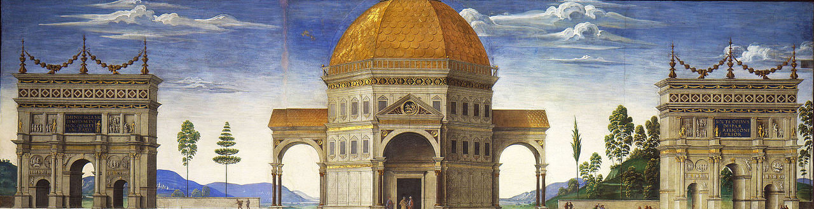

## 👋 Hi, I'm Egor (eghor2005)

⚡ Research interests: 

  
  
  
  

- Kolmogorov-Arnold neural networks,
- machine learning,
- fractal image compression,
- atomic functions
- arduino & esp32

 **📫 Reach me:**  

📌 [Atomic community](https://github.com/Atomic-community?view_as=public)

 **🔧 Skills:**  

